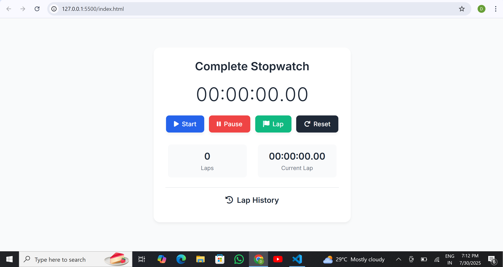

# Complete Stopwatch
A beautiful, fully functional stopwatch web application built using HTML, CSS, and JavaScript. It features start, pause, reset, and lap functionalities along with lap history and live lap tracking — all wrapped in a responsive and modern user interface.

# Overview
This stopwatch allows users to measure time with precision and record multiple lap times. The UI is interactive and designed for ease of use on both desktop and mobile devices.

# Tech Stack
(i)-HTML5 – For page structure and semantic markup

(ii)-CSS3 – For styling and responsive design (using CSS variables and media queries)

(iii)-JavaScript (Vanilla) – For all stopwatch logic, state management, and DOM manipulation

(iv)-Font Awesome – For intuitive button icons

(v)-Google Fonts (Inter) – For sleek and clean typography

# Features
(i)-Start/Pause Timer – Toggle between running and pausing the timer

(ii)-Reset Timer – Clear time and lap history instantly

(iii)-Lap Recording – Track and display multiple laps with individual and total time

(iv)-Live Current Lap Display – Show ongoing lap duration in real-time

(v)-Lap History Log – View a scrollable list of all recorded laps

(vi)-Responsive Design – Mobile-first layout with smooth animations and modern UI

(vii)-Keyboard & Mouse Friendly – Button controls with intuitive feedback

# UI Functionalities
(i)-Real-time display in HH:MM:SS.ms format

(ii)-Animated lap entries with fade-in effect

(iii)-Color-coded buttons for different actions:

    Blue: Start
    Red: Pause
    Green: Lap
    Dark: Reset

(iv)-Scrollable lap list for performance history

# Project Structure
     📁 stopwatch-project/
      ├── index.html
      ├── style.css
      ├── script.js
      ├── Readme.md
      └── assets/
        └── preview.png   

# Preview

# Contributing
Pull requests are welcome. For major changes, please open an issue first to discuss what you would like to change.